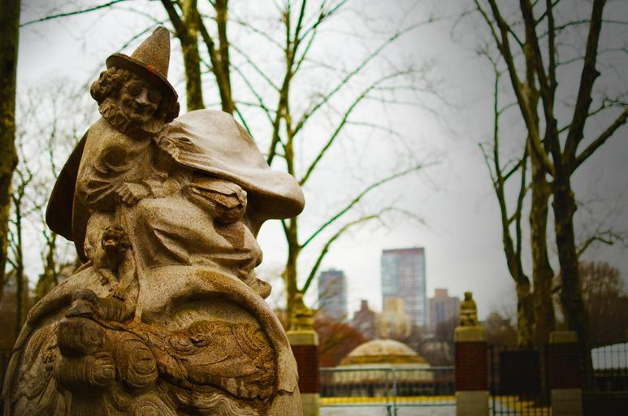
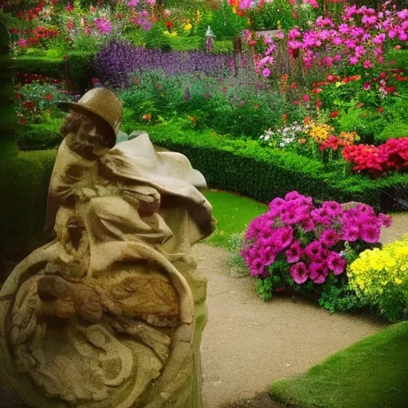
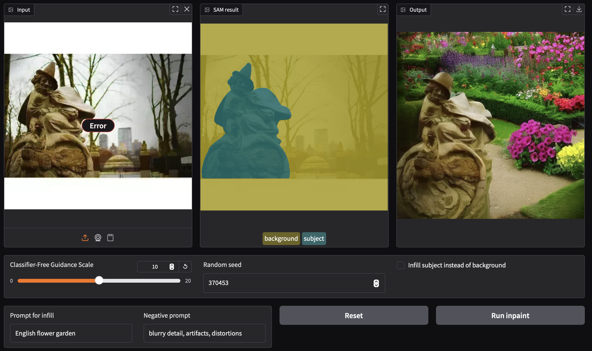

# Course 4 Project: SAM Inpainting

```
python3 --version
Python 3.13.3

python3 -m venv venv
source venv/bin/activate

pip install -r requirements.txt

jupyter lab --browser=chrome --notebook-dir=./notebooks
```

[central_park_gnome_statue.jpg](https://free-images.com/display/central_park_gnome_statue.html) image was acquired from pixabay. 
It was marked as Public Domain or CC0 and is free to use. 
To verify, go to the source and check the information there.




- Classifier-Free Guidance Scale = 10
- Random seed = 370453
- Prompt for infill = English flower garden
- Negative prompt = blurry detail, artifacts, distortions




